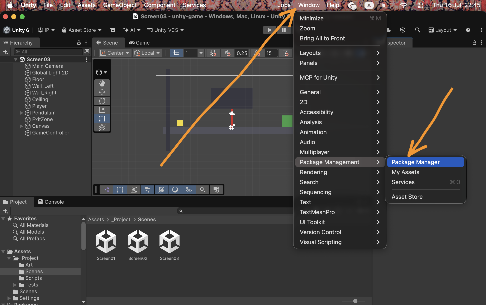
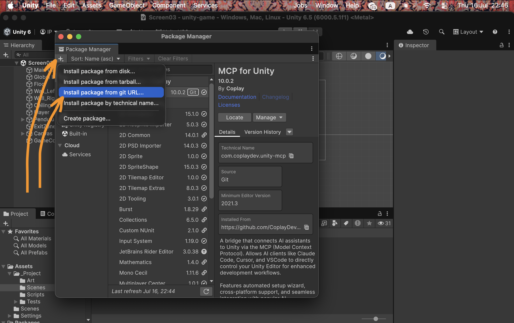
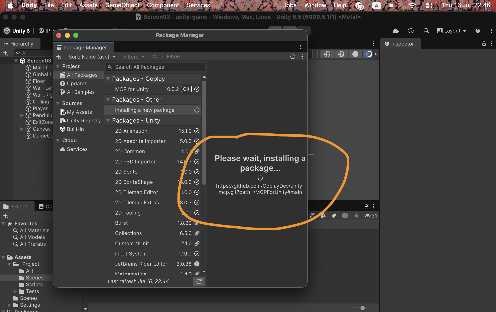
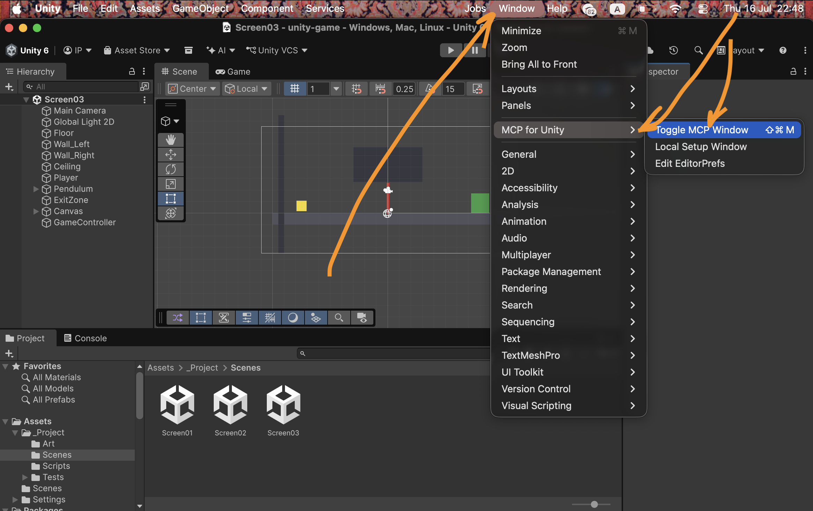
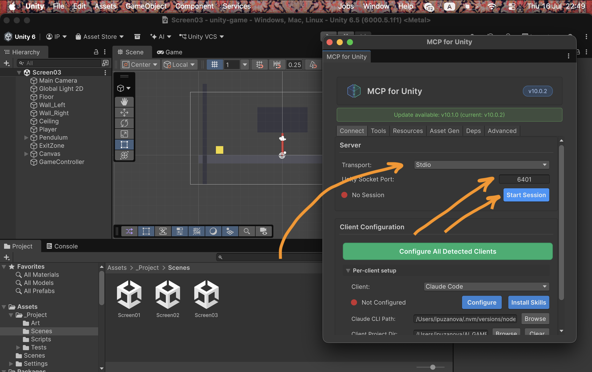
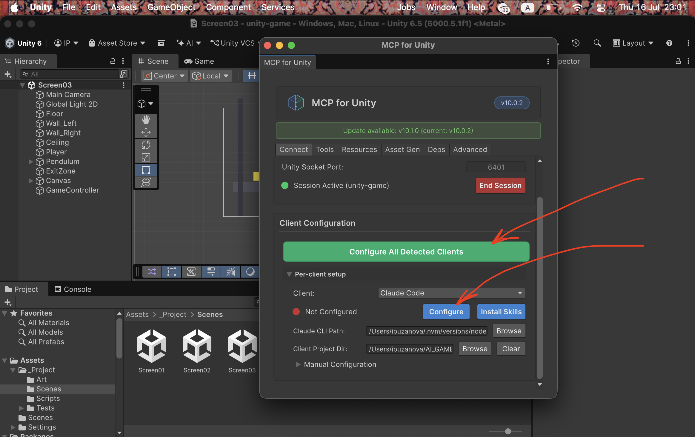

# Unity + Unity MCP — установка и подключение к Claude

Инструкция для того, кто ставит Unity с нуля и хочет, чтобы его AI-агент
(**Claude Code**) мог работать прямо внутри Unity Editor через **Unity MCP**.

Unity MCP — это мост, который открывает редактор Unity для AI-агента: агент может
читать сцену, консоль, состояние проекта и выполнять действия (создавать объекты,
писать скрипты, запускать Play Mode и т.д.). В основе — открытый пакет
**CoplayDev “MCP for Unity”** (лицензия MIT).

---

## 1. Что нужно заранее

- **Unity Hub + Unity Editor.** Поддерживаются версии от Unity 2021.3 LTS до Unity 6.
  Скачать: <https://unity.com/download>.
- **Claude Code** (CLI) — установлен и выполнен вход.
  Проверка: `claude --version` в терминале.
- **Python 3.10+** и **`uv`** должны быть в `PATH`:
  - macOS: `brew install uv`
  - Windows / Linux: см. <https://docs.astral.sh/uv/> (инструкция по установке `uv`).
  - Проверка: `uv --version` и `python3 --version`.

---

## 2. Установить Unity

1. Установить **Unity Hub**, затем через него — **Unity Editor** нужной версии.
2. Создать новый проект (любой шаблон, например 2D или 3D) или открыть существующий.
3. Дождаться, пока проект полностью откроется в редакторе.

---

## 3. Установить пакет MCP for Unity в проект

Внутри открытого редактора Unity:

**3.1.** Открыть **Window → Package Management → Package Manager**.



**3.2.** В окне Package Manager нажать **«+»** (слева сверху) →
**Install package from git URL…**



**3.3.** Вставить целиком этот адрес и подтвердить:

```
https://github.com/CoplayDev/unity-mcp.git?path=/MCPForUnity#main
```

Дождаться окончания установки (появится индикатор «Please wait, installing a
package…»).



> Установка пакета изменяет `Packages/manifest.json` проекта — это нормально.
> Технический идентификатор пакета — `com.coplaydev.unity-mcp`.

---

## 4. Открыть окно MCP и запустить сессию

**4.1.** Открыть **Window → MCP for Unity → Toggle MCP Window**.



**4.2.** В открывшемся окне на вкладке **Connect**:

1. **Transport** → выбрать **`Stdio`** (важно — не HTTP).
2. Нажать **Start Session** (индикатор слева станет зелёным вместо «No Session»).



---

## 5. Подключить Claude Code

В том же окне MCP, в разделе **Client Configuration**:

- Проще всего — нажать **«Configure All Detected Clients»** (настроит все найденные
  клиенты автоматически), **или**
- В **Per-client setup** выбрать **Client → Claude Code** и нажать **Configure**.
  Кнопка **Install Skills** (по желанию) добавит вспомогательные навыки.



Проверить подключение из терминала (**редактор Unity должен быть ОТКРЫТ** — мост
живёт внутри работающего редактора):

```
claude mcp get UnityMCP
```

Статус должен быть **Connected / ✔**.

После этого Claude Code автоматически видит все инструменты Unity (создать объект, править сцену, писать скрипты, читать консоль, запускать Play и т.д.) с их описаниями — плюс сам MCP-сервер отдаёт Claude свою встроенную инструкцию по применению. То есть механически «как работать в Unity» Claude поймёт без всякого промпта, просто из подключённых инструментов на этом шаге.

---

## 6. Быстрая проверка, что всё работает

Открыть сессию Claude при **открытом** редакторе Unity и попросить:

> «Создай пустой GameObject в открытой сцене.»

Если объект появился в иерархии — мост работает.

---

## 7. Необязательный блок с подсказками для Claude

Этот блок **не обязателен**: после шага 5 Claude уже видит инструменты Unity и умеет
с ними работать (плюс сам MCP-сервер отдаёт ему встроенную инструкцию). Блок лишь
добавляет полезные привычки и помогает не спотыкаться на мелочах — какой редактор
выбрать, проверять консоль после правки скриптов, что делать, если инструменты не
видны. Можно вставить его в проект как файл `CLAUDE.md` (в корне проекта) или
отправить первым сообщением в сессии:

```markdown
# Работа с Unity через MCP

К этому проекту подключён MCP-сервер `UnityMCP` (мост CoplayDev «MCP for Unity»,
транспорт stdio). Через него ты управляешь Unity Editor.

Правила:
- Редактор Unity должен быть ОТКРЫТ — мост работает внутри живого редактора.
- Выбор инстанса: сначала прочитай ресурс `mcpforunity://instances`, чтобы увидеть
  открытые редакторы. Если открыт один — просто работай. Если несколько, зафиксируй
  цель через `set_active_instance` со значением `ИмяПроекта@hash`, либо передавай
  параметр `unity_instance` в каждом вызове.
- РЕСУРСЫ — для чтения состояния (сцена, консоль, состояние редактора и т.п.).
  ИНСТРУМЕНТЫ — для действий и изменений. Сначала читай состояние, потом меняй.
- После создания или изменения C#-скриптов вызывай `read_console`, чтобы проверить
  ошибки компиляции; дождись окончания перекомпиляции (поле `isCompiling` в
  состоянии редактора) прежде чем использовать новые типы/компоненты.
- Делай минимальное изменение, решающее задачу; перед правкой осматривай иерархию
  и консоль.

Если инструменты Unity не видны или «instance_count: 0» — вероятно, редактор на
HTTP, а клиент на stdio: попроси пользователя переключить Transport на stdio в
окне Window → MCP for Unity и запустить сессию заново.
```

---

## Ссылки

- Пакет MCP for Unity (CoplayDev): <https://github.com/CoplayDev/unity-mcp>
- Установщик `uv` / `uvx`: <https://docs.astral.sh/uv/>
- Unity: <https://unity.com/download>
- Claude Code: <https://claude.com/claude-code>
